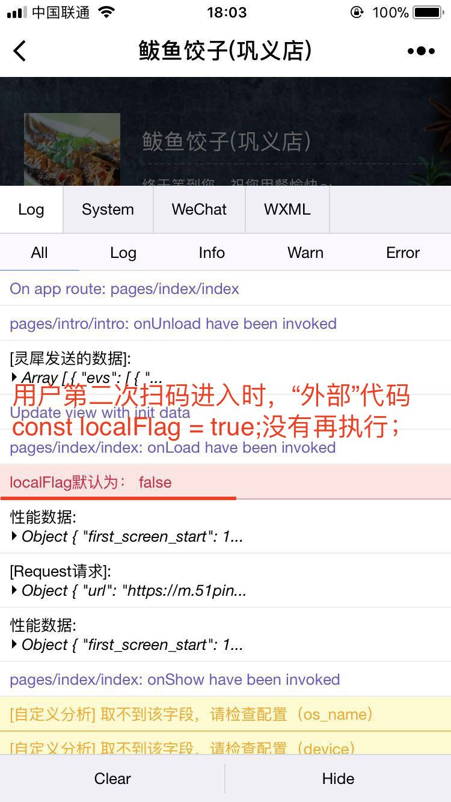

# 小程序退出后扫码再进入，“外部”代码不会再次执行

## 作者: [蒋欢](https://github.com/Dragon-Rider)

### 问题：
小程序退出后再次扫码进入，只会执行生命周期函数里的代码，“外部”代码不会再执行。

### 具体描述：
在我们的项目里，我们会将一部分本地变量不写在小程序 pageConfig 的 [data][1] 中，而直接在文件头进行声明。这样是为了减少 data 的大小，加快页面渲染速度。但这也无意中带来了新问题，我们看看下面的例子。

**出错的index.js文件**：

````
    const localFlag = true; // “外部”代码，仅执行一次初始化，第二次扫码不会执行！

    const pageConfig = {
        data: {
            text: 'init data'
        },
        onLoad(this, p) {  
            console.error("localFlag默认为："， localFlag);

            // Do something you need...
            localFlag = false;
        }
    }

    Page(pageConfig);
````

按照以上代码运行，用户初次扫码时，localFlag的值为true。可是，**当用户退出小程序，再次扫码进入时，localFlag没有再初始化，而为false了**。如下图所示：
<div align="center">
    
    <p style="color: grey">图1 用户二次扫码进入小程序，localFlag为false</p>
</div>

如何避免上述情况的出现呢？

其实也很简单，就是在文件头部只做本地变量声明，而不做定义。将定义部分放在生命周期函数（如：onload）内。具体代码如下：

**正确的ndex.js文件**：

````
    const localFlag; // 只做变量声明而不定义

    const pageConfig = {
        data: {
            text: 'init data'
        },
        onLoad(this, p) {  
            localFlag = true;
            console.error("localFlag默认为："， localFlag);

            // Do something you need...
            localFlag = false;
        }
    }

    Page(pageConfig);
````

如此，每次进入页面 localFlag 都会被置为 true 了。

### 环境：
IOS 和 安卓 均可稳定复现。

### 原因：
这看起来属于小程序自身的模块设计方式导致的。推测即使退出小程序，之前打开的页面也没有做到真正卸载，而处在内存之中。下次再次进入同一个页面时，会被唤起。

### 解决方案：
只在头部代码进行本地变量声明，**而不定义**。将本地变量的定义放在生命周期函数中去。

### 风险：
属于小程序开发的经验积累相关。


[1]: https://mp.weixin.qq.com/debug/wxadoc/dev/framework/app-service/page.html


