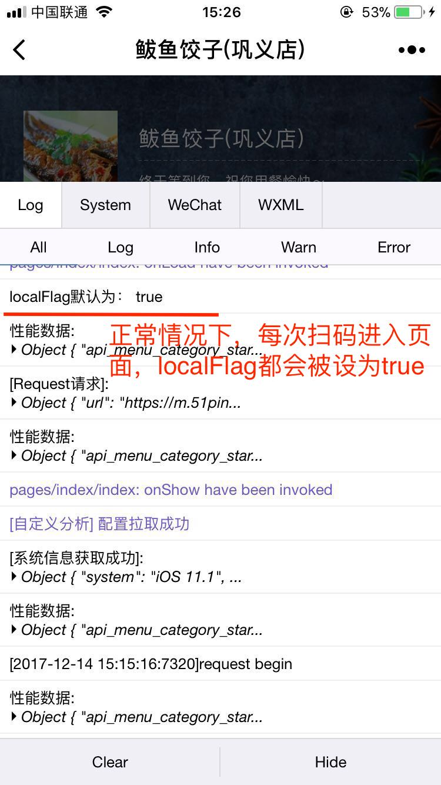
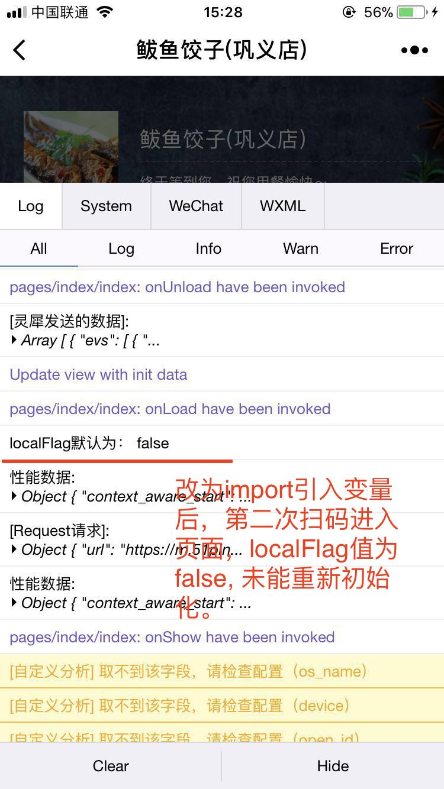

# 小程序退出后扫码再进入，加载（import）的模块无法再次初始化

## 作者: [蒋欢](https://github.com/Dragon-Rider)

### 问题：
将小程序的页面上的变量，抽离为一个独立js模块import进页面。重新加载页面时，数据不会进行初始化重置。

### 具体描述：
1、在过去的代码里，我们会将本地变量在页面进入时进行初始化设置。这样每次打开页面时会使用默认值初始化，之后在业务逻辑中再进行对应的改变操作。

**修改前的index.js文件**：
````
    const localFlag = true; // 本地变量初始化

    onLoad(this, p) {  
        console.log("localFlag默认为："， localFlag);

        // Do something you need...
        localFlag = false;
    }
````
正常情况下，每次扫码进入页面，本地变量会重新初始化。所以按照以上写法，每次进入页面，onLoad内localFlag的值均为true。如图一所示：
<div align="center">
    
    <p style="color: grey">图1 正常情况下每次扫码进入页面，localFlag会重新初始化，为true</p>
</div>


2、但在某一个业务迭代中，由于本地变量过多，我们考虑将变量统一放在同一个js文件中，再一起import到页面上。

**修改后的index.js文件**：
````
    import * as navHelper from '../../modules/navHelper';

    onLoad(this: IndexPage, p) {
        console.log("localFlag默认为："， navHelper.localFlag);

        // Do something you need...
        navHelper.localFlag = false;
    }
````
**navHelper.js文件**：
````
export let localFlag = true
````

之后会发现，但用户初次扫码是，localFlag的值为true。可是当用户退出小程序，**再次扫码进入时，localFlag没有再次初始化，而为false了**。如图二所示：
<div align="center">
    
    <p style="color: grey">图2 使用import方法，用户二次扫码进入小程序，localFlag为false</p>
</div>

**说明**：在小程序的运行环境中，通过import方式引入的模块和页面本身的环境是隔离开的。每次扫码进入页面后，页面环境会再次初始化，而页面上import的其他模块不会再初始化了。


### 环境：
IOS 和 安卓 均可稳定复现。

### 原因：
这看起来属于小程序自身的模块设计方式导致的。

### 解决方案：
将分离出去的数据模块重新合到该页面中维护，让页面重新加载时正常初始化本地变量即可。

### 风险：
属于小程序开发的经验积累相关。


